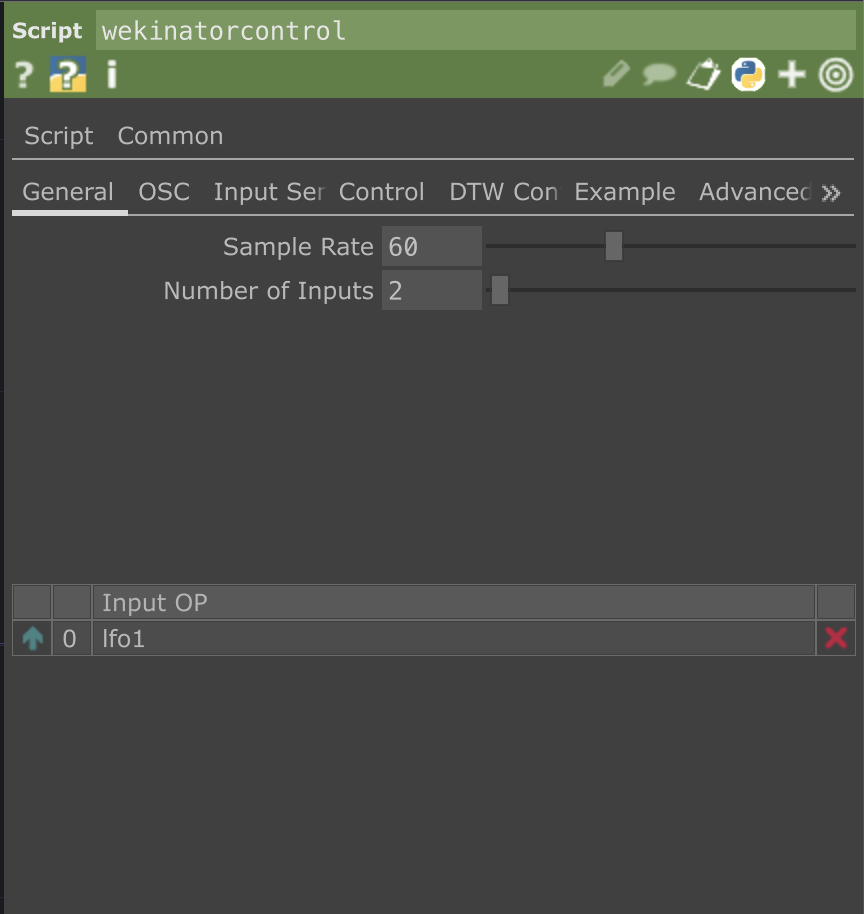
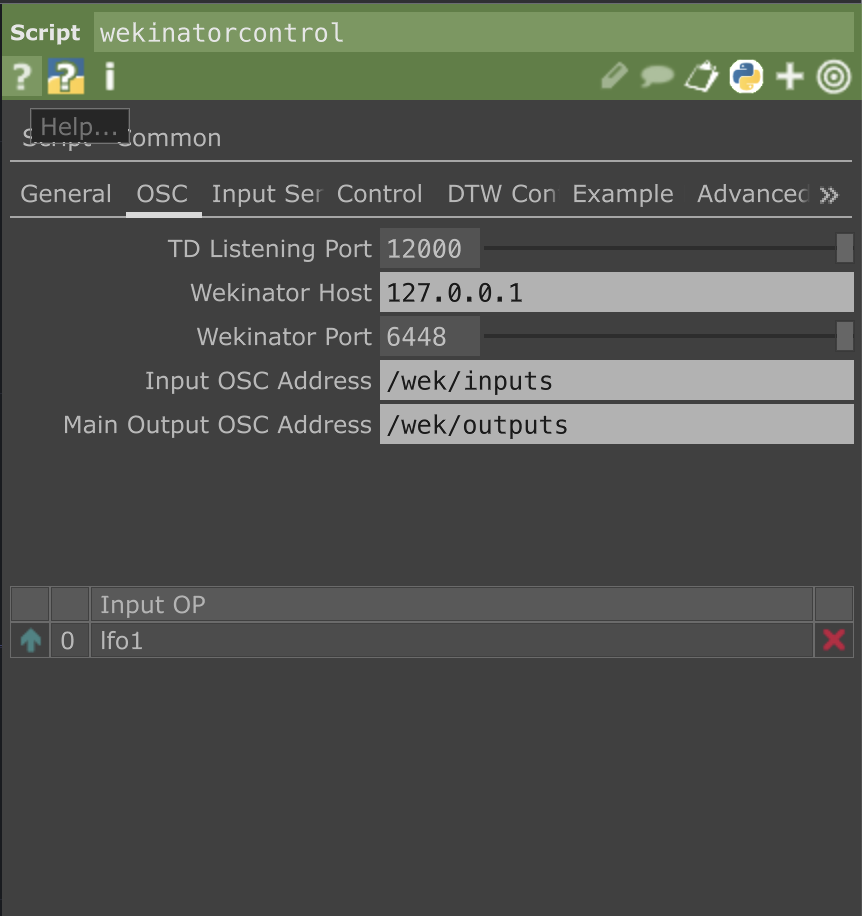
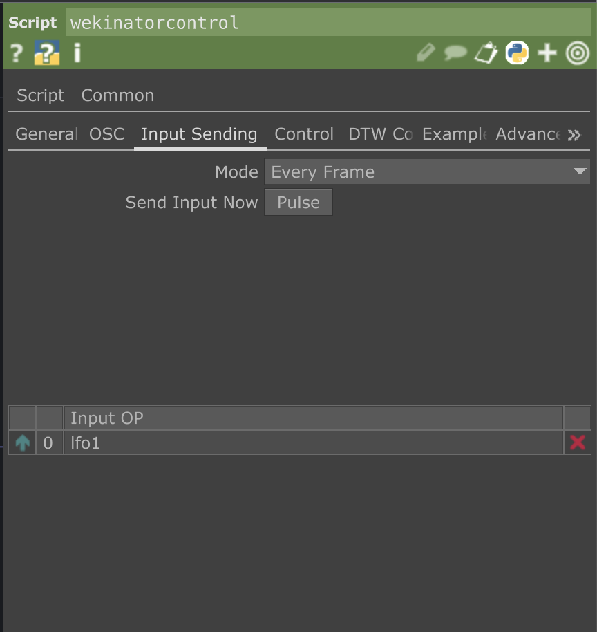
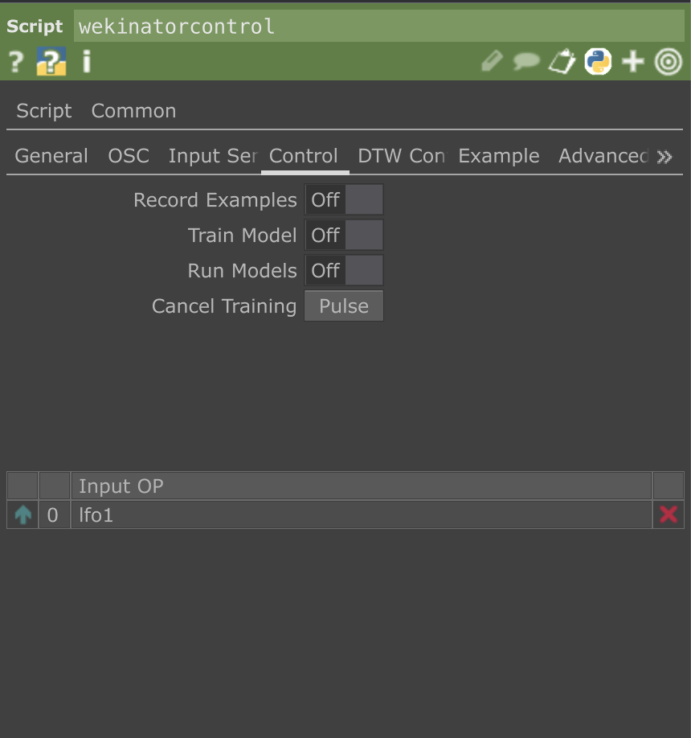
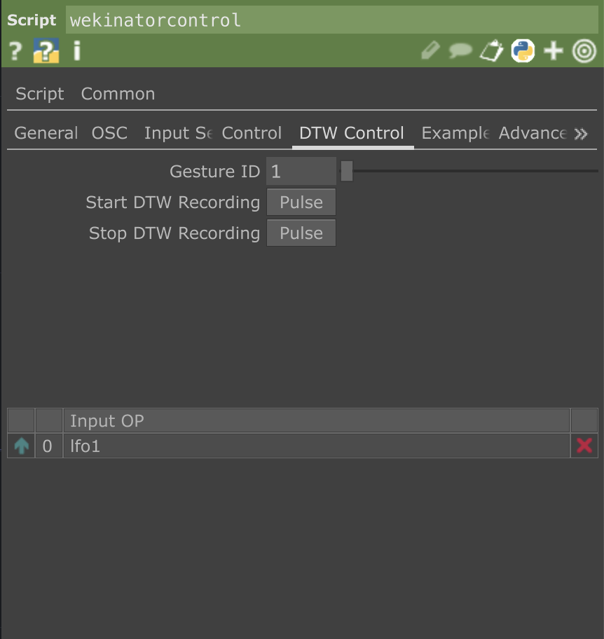
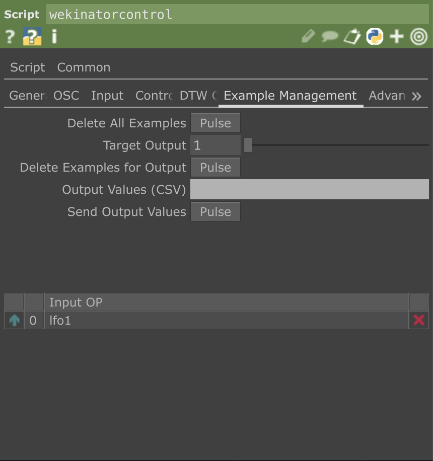
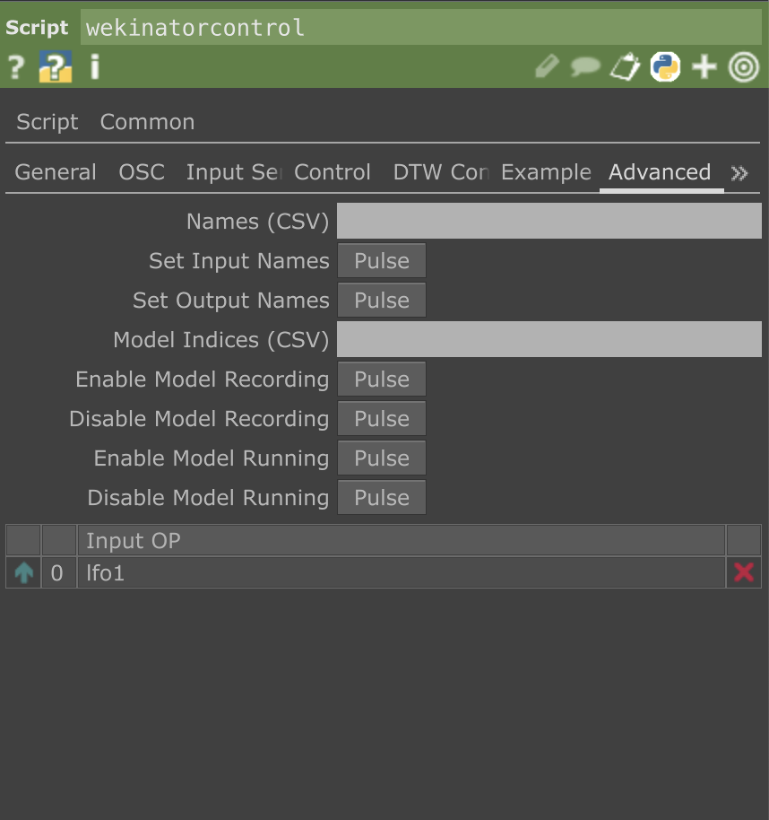

# TouchDesigner–Wekinator Controller

A robust, production-grade bi-directional OSC controller for Wekinator, implemented as a single Script CHOP for TouchDesigner. Enables full control and monitoring of Wekinator’s training and inference process, replacing manual GUI interaction.

## What is TouchDesigner?

[TouchDesigner](https://derivative.ca/) is a node-based visual programming environment developed by Derivative, primarily used for real-time interactive media systems. It is widely employed in audiovisual installations, live performances, and immersive interface design due to its flexibility, low-latency processing, and extensive I/O capabilities.

## What is Wekinator?

[Wekinator](http://www.wekinator.org/) is an interactive machine learning software developed by Rebecca Fiebrink. It allows users to build real-time ML models by receiving input via OSC and training them on-the-fly using supervised learning techniques. Wekinator is commonly used in creative coding, gesture recognition, and HCI research.

## Features

- Fully socket-based OSC communication (UDP)
- Seamless toggling of record, train, and run modes
- Dynamic parameterisation of inputs, models, and names
- DTW gesture recording and event handling
- Realtime Wekinator output parsing
- User-friendly UI for all common workflows
- No dependencies, no external Python modules

## Requirements

- **TouchDesigner** 2022.3 or later  
- **Wekinator** 1.0.1 or later  
- Tested on macOS & Windows  
- Python 3.7+ (TouchDesigner embedded)

## Usage

1. Create a new Script CHOP.
2. Paste the full script into the `Callbacks DAT`.
3. Connect your input CHOP (e.g., sensors, MIDI, sliders).
4. Set parameters according to your Wekinator configuration.
5. Start Wekinator and enable “OSC Control of GUI”.
6. Use toggle/pulse parameters to control and monitor in real time.

> For more information on parameters, see [Wiki](https://github.com/saimgulay/TouchDesigner-WekinatorControlCHOP/wiki/Wekinator-Control-CHOP) page of this repository.

## File Structure

- `script1_callbacks`: Core implementation (single file, fully self-contained)
- No external assets, modules, or operator dependencies

## Status

This controller is **stable** and used in professional HCI/XR prototyping.  
All feedback, forks, and contributions are welcome.

## License

MIT License.  
Attribution required if forked or integrated into larger tools. See LICENSE file.

---

## TouchDesigner Wekinator Controller — User Manual

**Version:** 1.0
**Author:** [@saimgulay](https://github.com/saimgulay)

**Compatibility:** TouchDesigner 2022.3+  
**Tested with:** Wekinator v1.0.1 on macOS & Windows  
**OSC Standard:** Compliant with Open Sound Control (UDP-based)

---

## 1. Purpose

This Script CHOP enables two-way, socket-level communication between TouchDesigner and Wekinator, allowing:

- Manual or automatic transmission of input features to Wekinator.  
- Full control over Wekinator’s training and runtime behaviour via OSC.  
- Real-time retrieval and visualisation of Wekinator’s outputs, including DTW triggers.

It replaces manual GUI interactions in Wekinator and eliminates the need for external OSC tools (e.g. Max/MSP, Processing).

## 2. Parameters Overview

### General
- **Sample Rate:** Output rate of the CHOP (Hz).  
- **Number of Inputs:** Number of input channels to read from the first connected CHOP input.

### OSC Settings
- **TD Listen Port:** Port to receive messages from Wekinator (default: 12000).  
- **Wekinator Host IP:** Typically `127.0.0.1`, unless Wekinator runs on another machine.  
- **Wekinator Listen Port:** Wekinator’s input port (default: 6448).  
- **Input OSC Address:** Default: `/wek/inputs`  
- **Main Output OSC Address:** Default: `/wek/outputs`

### Input Sending
- **Input Sending Mode:**  
  - *Every Frame:* Automatically sends input each frame.  
  - *On Pulse:* Sends input only when triggered manually.  
- **Send Input Now:** Manually sends current input values to Wekinator.

### Control
- **Record Examples:** Start/stop recording training data (`startRecording`, `stopRecording`).  
- **Train On/Off:** Trigger training (`train`, `cancelTrain`).  
- **Run Models:** Start/stop live prediction (`startRunning`, `stopRunning`).  
- **Cancel Training:** Abort current training process.

### DTW Control
- **Gesture ID:** Selects DTW class (starting from 1).  
- **Start DTW Record / Stop DTW Record:** Controls gesture recording.

### Example Management
- **Delete All Examples:** Clears all examples from Wekinator.  
- **Target Output Index:** Model index to delete examples for.  
- **Delete Examples for Output:** Deletes examples for selected output.  
- **Set Output Values:** Manually specify mock outputs (comma-separated floats).  
- **Send Output Values Now:** Sends mock outputs to Wekinator GUI.

### Advanced Configuration
- **Names (CSV):** Input/output names as comma-separated string.  
- **Set Input Names / Set Output Names:** Applies `setInputNames` / `setOutputNames` (only during setup).  
- **Model Indices (CSV):** Comma-separated integers (1-based).  
- **Enable/Disable Model Recording:** Toggles individual model recording.  
- **Enable/Disable Model Running:** Toggles individual model runtime.

---

## 3. How It Works (Execution Flow)

- A UDP socket is created on the TouchDesigner side.  
- A background thread (`recv_loop()`) listens for Wekinator output.  
- Incoming data is parsed and mapped to CHOP output channels.  
- OSC messages are built according to Wekinator's control protocol.  
- Parameter toggles are actively monitored and sent when changed.

---

## 4. Usage Recommendations

### Initial Setup:
- Ensure Wekinator is running with *Enable OSC Control of GUI* checked.  
- Avoid changing ports once training starts.  
- Match input/output counts between Wekinator and the script.

### 5. Live Usage:
- Use **Every Frame** mode for real-time prediction.  
- Use **On Pulse** mode during testing or data collection.  
- Avoid toggling multiple parameters at once.  
- Never use `setInputNames` or `setOutputNames` after training begins.

---

## 6. Output Channels (CHOP Output)

- **output1, output2, …** → Wekinator primary model outputs (`/wek/outputs`)  
- **wek_state1, wek_state2, …** → Other OSC addresses translated to CHOP channels  
- **dtw_event_#** → Triggered when Wekinator outputs `/output_#` for DTW gestures

---

## 7. Troubleshooting

| Symptom | Possible Cause | Resolution |
|--------|----------------|------------|
| Wekinator only responds once | Stops processing after some control messages | Restart Wekinator; avoid malformed sequences |
| Inputs not sent | Wrong Sending Mode or incorrect input count | Set mode to **Every Frame**, verify CHOP input |
| No output appears | Wekinator isn’t sending `/wek/outputs` | Ensure model is trained & running |
| Toggle does nothing | Port mismatch or firewall block | Check port config; disable firewall if needed |

---

## 8. Performance Optimisation

- Debug prints are disabled in production.  
- Output is single-sample, non-timesliced.  
- OSC messages are sent only when state changes.  
- Minimal memory and CPU footprint by design.

---

## 9. Security and Networking Notes

- Uses **UDP** — connectionless, stateless.  
- For remote use, ensure port permissions in firewalls.  
- Prefer `localhost` for lowest latency and highest stability.

---

## 10. Final Remarks

This system is engineered for:

- **Realtime precision**  
- **Full automation**  
- **Hands-off ML integration**

It pushes both TouchDesigner and Wekinator to their integration limits. Ideal for performance-critical setups and responsive installations.

For feedback or issues, contact: [@saimgulay](https://github.com/saimgulay)  
If forking or redistributing, **preserve author credit and original logic**.

---

# Screenshots

This section showcases key UI screens and integration points of the TouchDesigner ↔︎ Wekinator bridge in action. All screenshots were taken directly from the production environment within TouchDesigner, using the custom Script CHOP and related UI controls.

---

### 1. Input Parameter Configuration

---

### 2. OSC Settings for Bi-Directional Communication

---

### 3. Input Sending Options (Auto / Manual)

---

### 4. Control Section for Record, Train, Run

---

### 5. DTW Gesture Recording Controls

---

### 6. Example Management Panel

---

### 7. Output Channels Visualised Dynamically

## HUMAN-COMPUTER INTERACTION LENS

# TouchDesigner ⇄ Wekinator OSC Controller

## Executive Summary

This project presents a robust and low-latency OSC-based controller interface that integrates TouchDesigner with Wekinator’s machine learning backend. Developed as a scriptable and fully encapsulated Script CHOP, the system empowers artists and HCI researchers to train, run, and manipulate Wekinator models programmatically, without relying on manual GUI operations.

The primary objective is to provide deterministic control over Wekinator’s pipeline (recording, training, running, and example management) in live or interactive environments, particularly within real-time audiovisual or embodied interaction contexts. The solution addresses previously unresolved limitations in Wekinator's control stability and input synchronisation.

---

## Background & Motivation

Wekinator is widely used in interactive machine learning scenarios, particularly for gesture recognition and real-time control in creative coding environments. However, its default interaction paradigm relies heavily on its Java-based GUI, making automation and system integration problematic for time-critical or embedded applications.

TouchDesigner, on the other hand, is frequently employed in performance-driven installations where latency, determinism, and modularity are critical. Without a stable bridge between these two systems, users often resort to fragile workarounds or abandon Wekinator altogether.

This tool was designed to overcome that integration gap—allowing full bi-directional communication between TouchDesigner and Wekinator using the Open Sound Control (OSC) protocol, while preserving Wekinator's internal consistency and preventing message-loss issues that have historically plagued such integrations.

---

## User & Stakeholder Requirements

### Primary Users
- Interactive media artists  
- Performance technologists  
- HCI researchers  
- ML educators

### Stakeholders
- Developers working on multimodal interaction  
- Instructors delivering creative coding workshops  
- Institutions deploying interactive exhibitions

### Identified Needs
- Deterministic, frame-accurate input-output control  
- Full access to Wekinator’s internal training pipeline via code  
- Ability to work without touching the Wekinator GUI  
- Fault-tolerant behaviour in long-running sessions

---

## Design Process / Methodology

A **Double Diamond** design framework was followed, progressing from problem framing to implementation in four stages:

1. **Discover:** Reviewed known issues from community forums regarding Wekinator control message failures.  
2. **Define:** Isolated problem conditions (e.g., `/startRecording` interrupting the OSC thread).  
3. **Develop:** Built a modular script with scoped global states, input validation, and toggle-differential signalling.  
4. **Deliver:** Iteratively tested in a variety of real-time audiovisual pipelines.

Internal state synchronisation was implemented to prevent repeated or conflicting control messages—such as redundant training or run toggles—thus eliminating causes for socket instability.

---

## Technical Architecture

- **Input Layer:** Incoming OSC messages to TouchDesigner are parsed and stored in a thread-safe dictionary.  
- **Control Layer:** Outgoing control messages to Wekinator are triggered based on UI parameter toggles, avoiding redundant sends.  
- **Transport:** UDP sockets using Python’s `socket` module (blocking read loop, isolated thread).  
- **Command Layer:** Covers 20+ Wekinator commands including training, DTW control, and model toggling.  
- **Output Layer:** OSC outputs received from Wekinator are converted into dynamic channels in the Script CHOP.

The system remains stateless in terms of data persistence but synchronised in terms of runtime state. The architecture also tolerates OSC message loss without compromising system integrity.

---

## Prototyping Tools & Frameworks

- **TouchDesigner:** Node-based real-time media platform used for live input/output processing and UI interaction  
- **Python (3.x):** Embedded inside TouchDesigner for networking, state management, and dynamic parameter logic  
- **OSC (UDP):** Lightweight, low-latency communication protocol used for message exchange  
- **Wekinator:** Java-based ML runtime receiving OSC messages for model training and inference

No external libraries or SDKs are required beyond TouchDesigner’s default environment.

---

## Key Features

- **Full Control Coverage:** All of Wekinator’s documented control messages are accessible, including gesture management, output selection, and model toggling  
- **Idempotent Messaging:** Control messages are only sent upon change, avoiding state conflicts or Wekinator deadlocks  
- **Dynamic Input Handling:** Input channel count and names are adjustable at runtime  
- **Output Parsing:** Dynamically creates and updates CHOP channels for all received OSC outputs and DTW triggers  
- **Robust Socket Lifecycle:** All socket threads and bindings are automatically cleaned up on script reload

---

## Evaluation / Testing

The system was evaluated across multiple test cases including:

- Repeated training cycles  
- Model reconfiguration during inference  
- DTW recording and playback under load  
- Toggle flooding edge cases  

Performance metrics showed stable operation over prolonged sessions (>2h) with no memory leaks, crashes, or dropped packets. Edge conditions involving improper message sequences (e.g., `/startRecording` immediately followed by `/train`) were mitigated via internal flag gating.

Formal user testing with novice users is planned for a future phase.

---

## Discussion & Limitations

### Achievements
- Resolved long-standing Wekinator control fragility in TouchDesigner environments  
- Enabled fully headless training pipelines for generative systems  
- Delivered a single-script, no-external-dependency architecture

### Limitations
- Wekinator’s own OSC handling (Java-based) remains a black box; control message queueing is not externally observable  
- No visual feedback from Wekinator’s GUI is captured  
- Model types and configurations must still be set manually in Wekinator’s setup screen

---

## Conclusion & Next Steps

The current system is a reliable and production-ready bridge between TouchDesigner and Wekinator. It offers significant advantages for rapid prototyping, live interaction, and HCI experimentation. As it stands, the tool is suitable for MVP-level deployment in interactive exhibits or live coding performances.

### Planned Enhancements
- OSC message visualiser and logger UI inside TouchDesigner  
- Feedback synchronisation between Wekinator model state and script parameters  
- Integration with auto-saving of training examples for reproducibility  
- GUI-less Wekinator headless wrapper (Java automation)

